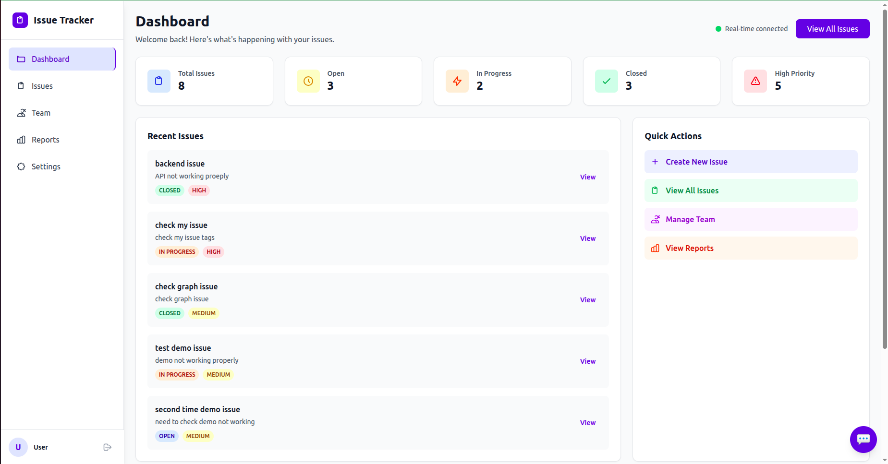
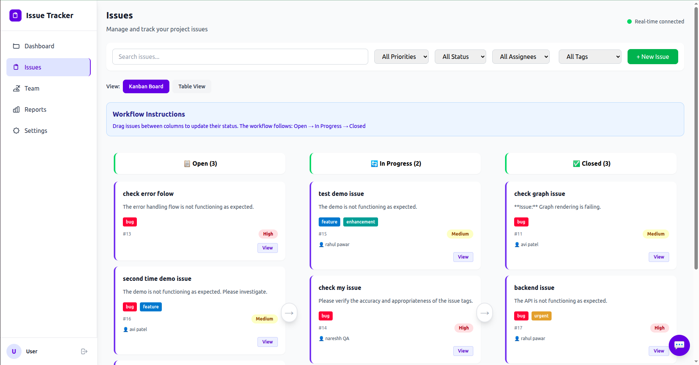
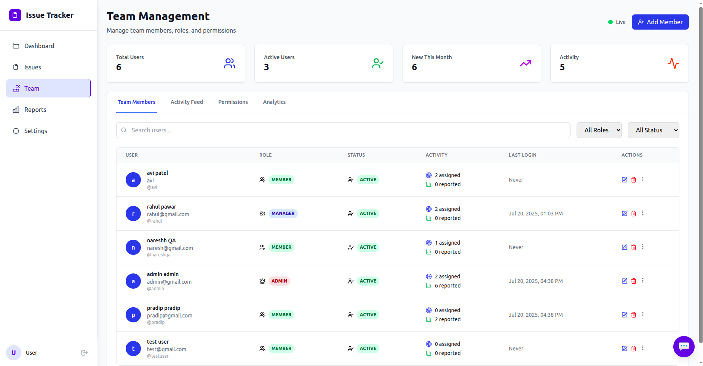
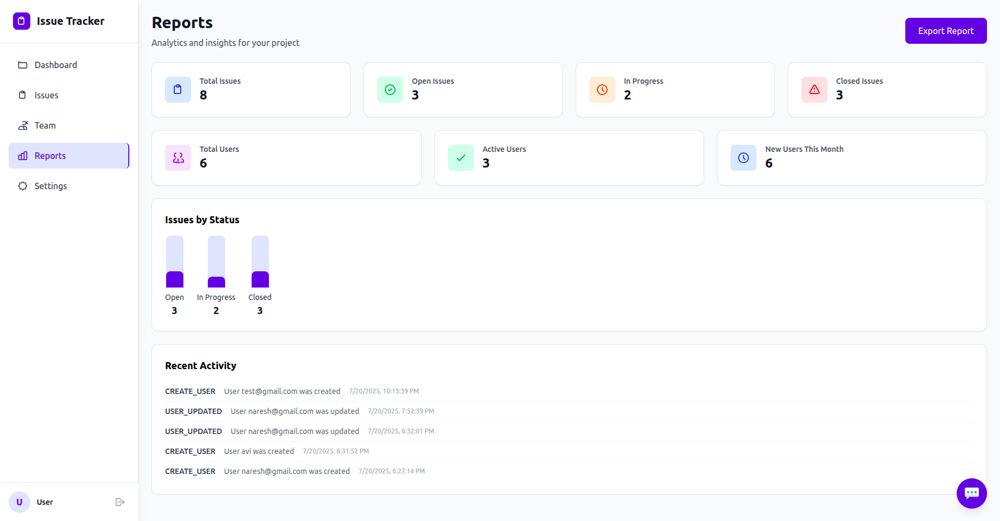
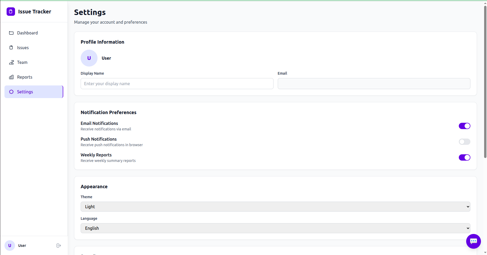
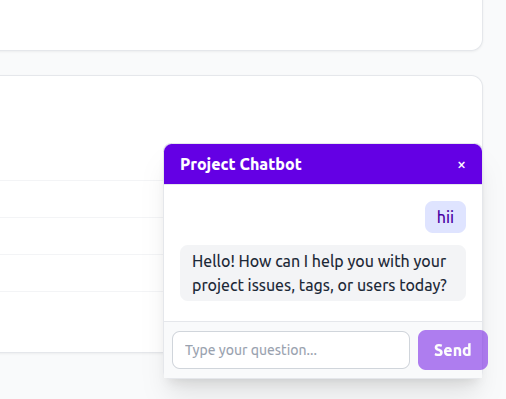

# Mini Issue Tracker

A full-stack, real-time issue tracking system with AI-powered features, built with FastAPI, Strawberry GraphQL, PostgreSQL, React, and LangChain + Google Gemini.

---

## Table of Contents

- [Project Overview](#project-overview)
- [Backend Setup (FastAPI)](#backend-setup-fastapi)
- [Frontend Setup (React)](#frontend-setup-react)
- [GraphQL API Reference](#graphql-api-reference)
  - [Queries](#queries)
  - [Mutations](#mutations)
  - [Subscriptions](#subscriptions)
- [Tooling & AI Integration](#tooling--ai-integration)
- [Known Limitations](#known-limitations)

---

## Project Overview

- **Backend:** FastAPI, Strawberry GraphQL, async SQLAlchemy, PostgreSQL, Alembic
- **Frontend:** React, Apollo Client, GraphQL, WebSockets
- **AI:** LangChain + Google Gemini for description enhancement and chatbot
- **Features:** Real-time updates, drag-and-drop Kanban, RBAC, JWT authentication, AI-powered descriptions, project-aware chatbot

---

## 📸 Screenshots

### Dashboard


### Issue Page


### Team Page


### Reports Page


### Settings Page


### AI Chatbot


## 🎥 Video Demo

Check out a full walkthrough of the Mini Issue Tracker in action:

[](https://www.loom.com/share/2415232b4b2e4401985f93b9cb99be7c?sid=aa802ff2-7148-4c95-8c60-f443fc3c3bee)

Or watch directly on [Loom](https://www.loom.com/share/2415232b4b2e4401985f93b9cb99be7c?sid=aa802ff2-7148-4c95-8c60-f443fc3c3bee).

---

## Backend Setup (FastAPI)

1. **Clone the repository:**
   ```bash
   git clone <repo-url>
   cd Mini\ Issue\ Tracker/issue-tracker-backend
   ```

2. **Create and activate a virtual environment:**
   ```bash
   python3 -m venv venv
   source venv/bin/activate
   ```

3. **Install dependencies:**
   ```bash
   pip install -r requirements.txt
   ```

4. **Configure environment variables:**
   - Copy `.env.example` to `.env` and fill in values (Postgres, Google Gemini API key, etc.)

5. **Run database migrations:**
   ```bash
   alembic upgrade head
   ```

6. **Start the backend server:**
   ```bash
   uvicorn app.main:app --reload
   ```

---

## Frontend Setup (React)

1. **Navigate to the frontend directory:**
   ```bash
   cd ../issue-tracker-frontend
   ```

2. **Install dependencies:**
   ```bash
   npm install
   ```

3. **Start the development server:**
   ```bash
   npm run dev
   ```

4. **Configure environment variables:**
   - Copy `.env.example` to `.env` and set the backend GraphQL endpoint.

---

## GraphQL API Reference

### Queries

- `issues`: List all issues (with tags, enhancedDescription, etc.)
- `issue(id: Int!)`: Get a single issue by ID
- `users`: List all users
- `tags`: List all tags
- `me`: Get current user profile
- `comments(issueId: Int!)`: List comments for an issue

### Mutations

- `createIssue(input: IssueCreateInput!)`: Create a new issue (AI-enhanced description)
- `updateIssue(input: IssueUpdateInput!)`: Update an issue (only by reporter, AI-enhanced)
- `deleteIssue(id: Int!)`: Delete an issue (only by reporter)
- `createTag`, `updateTag`, `deleteTag`
- `addComment(input: CommentCreateInput!)`
- `login(email, password)`: Get JWT token
- `createUser(input: UserCreateInput!)`
- `askChatbot(question: String!)`: Ask the AI-powered project chatbot

### Subscriptions

- `issueCreated`: Real-time issue creation
- `issueUpdated`: Real-time issue updates
- `issueStatusChanged(issueId: Int!)`: Real-time status changes

---

## Tooling & AI Integration

- **Backend:**
  - FastAPI (REST + GraphQL)
  - Strawberry GraphQL (schema, subscriptions)
  - async SQLAlchemy (PostgreSQL ORM)
  - Alembic (migrations)
  - JWT (authentication)
  - WebSockets (real-time updates)
  - **LangChain + Google Gemini**: Used in `app/services/ai.py` for:
    - Enhancing issue descriptions (clarity, bullet points, markdown)
    - Powering the project-aware chatbot (`askChatbot` mutation)
- **Frontend:**
  - React (UI)
  - Apollo Client (GraphQL queries, mutations, subscriptions)
  - react-beautiful-dnd, dnd-kit (drag-and-drop)
  - Tailwind CSS (styling)
  - react-markdown, rehype-highlight (markdown rendering)

---